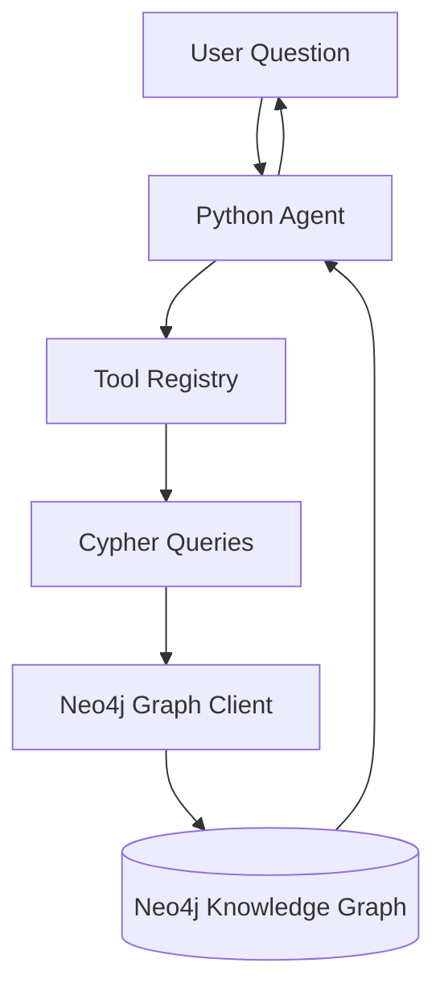

# System Architecture

This project follows a simple Knowledge Graph + Agent architecture where a Python agent interprets a user question and queries a Neo4j knowledge graph using Cypher.

## Overview

The system works as follows:

1. The user asks a question.
2. The Python agent interprets the question.
3. The agent selects an appropriate tool or query.
4. A Cypher query is executed via the Neo4j graph client.
5. Neo4j returns the result to the agent.
6. The agent prints the answer.

## Architecture Diagram

## Components

**User**  
A user interacts with the system through a terminal interface.

**Python Agent**  
The main logic that interprets user questions and selects the appropriate tool.

**Tool Registry**  
Maps keywords or intents to predefined Cypher queries.

**Cypher Queries**  
Graph queries used to retrieve information from the Neo4j database.

**Graph Client**  
Handles communication between Python and Neo4j using the Neo4j Python driver.

**Neo4j Knowledge Graph**  
Stores the energy network graph (PowerStations, Substations, Consumers).